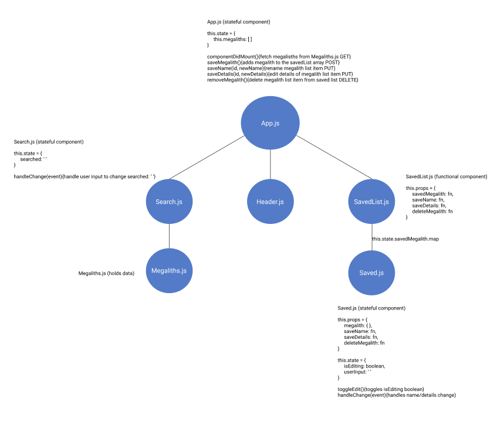
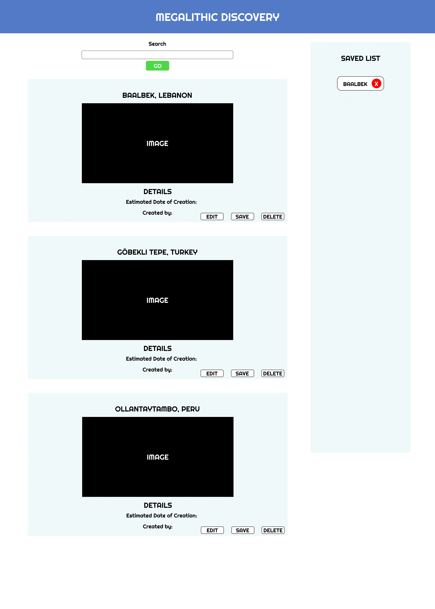

# Megalithic Discovery App
## NoDB Project for DevMountain

### Application Concept and Wireframe
#### Concept
- This is an app for viewing and discovering megalithic sites.
- Possibly utilize Google's Map API to show all sites found across the globe.
- Full CRUD
    - GET: get all megalithic sites
    - POST: Saved list item will be posted to saved list array
    - PUT: Edit details and name
    - DELETE: remove a site from the saved list array

#### Functionality
- Header at the top of the page
- When the app loads, display a list of megalithic site cards with name and details
- Select from Edit, Save, and Delete on each list item
- Saved list array will keep track of user's saved items
- Display the saved list array on the side with the ability to remove it

#### Endpoints
- GET - fetch list of megalithic sites from Megaliths.js data
- POST - push saved item to saved list array
- GET - fetch and render our saved list
- PUT - edit name/details/notes
- DELETE - remove a site from the master list and saved list

#### Component Architecture
- App.js (stateful: hold list of all megalithic sites)
    - Header.js (functional)
    - Search.js (stateful: handleChange for input in search box and render that one site)
    - SavedList.js (stateful: hold the saved list array of megalithic sites)
        - Megaliths.js (stateful: this.state.name, this.state.details, this.state.editing)

#### Wireframe

